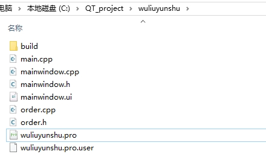
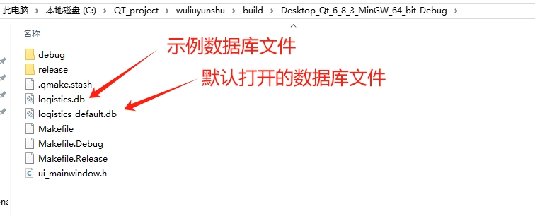
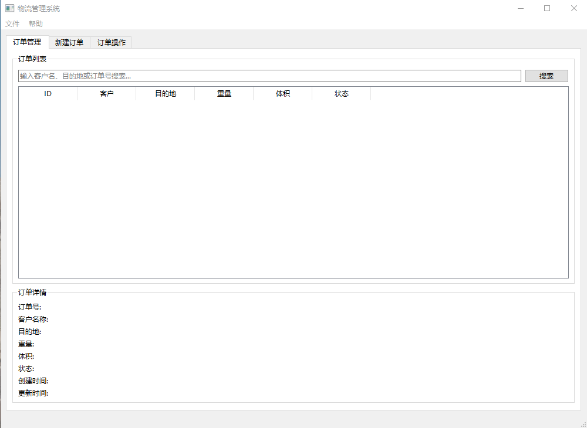
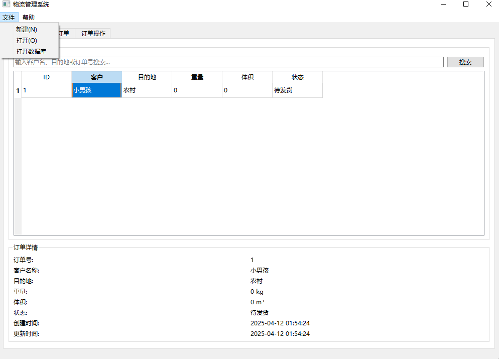
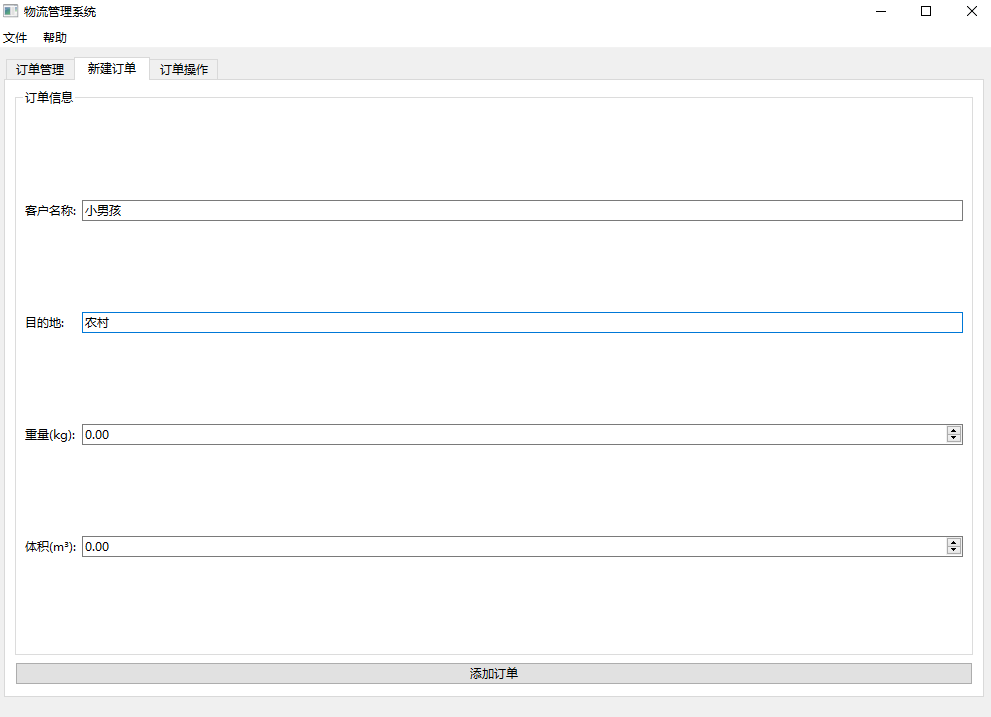
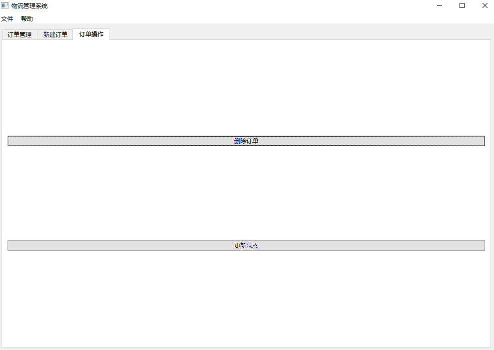

## 实习期间所做的QT界面，主要功能介绍在html文件中
### 在执行运行后会生成build文件夹

### build存放的可执行文件，包含存放的数据库文件。见图片

### 产品主界面如下所示，默认打开的数据库文件为  logistics_default.db
1 在文件菜单栏中提供了新建和打开数据库功能，客户订单展示提供订单详细信息
2 可以连接到数据库更新订单状态

### 客户订单新增界面如下

### 客户订单删除和更新界面如下

### 软件版本说明

版本说明：QMake version 3.1     Using Qt version 6.8.3 in C:/Qt/6.8.3/mingw_64/lib

使用qmake，Qmainwindow
